# Customize SQL System

## 系统介绍

customize sql system 是一款免登录的用户定制化case存储器 ，用户可以针对case对SQL语句进行定制化的分类绑定。并可以做出高效查询，结果

+ 自定义增删改查SQL语句
+ 根据case自定义分类SQL语句
+ 条件简化，参数输入简化，一键复制,  提升工作效率
+ 基于事务的实时存储

## 环境要求

> jdk11及以上

## 安装与使用

> [下载GUI.zip](https://github.com/Moline-x/customize-sql/releases)并解压
>
> 将h2data文件夹全部移动到C盘根目录
>
> 去掉customizeSQLv2.0.bat.txt中的.txt后缀
>
> 双击执行customizeSQLv2.0.bat脚本启动程序

## 使用说明

> **自定义SQL使用说明**

## 新增SQL语句

> 可以选择性的依次输入表名,条件,其他后置条件, 和key值，点击提交，会生成一条SQL语句。
>
> key值的存在是为了统一多个语句的不同条件名称, 假设语句A 的条件为agv_m, 语句B的条件为ht_m，若两条语句的条件值相同而只是名称不同的话，则可以设定一个统一的key值:ht_m，这样将来在显示菜单输入参数的时候则只需要输入一次key值，而不用既输入agv_m的值，由输入ht_m的值。

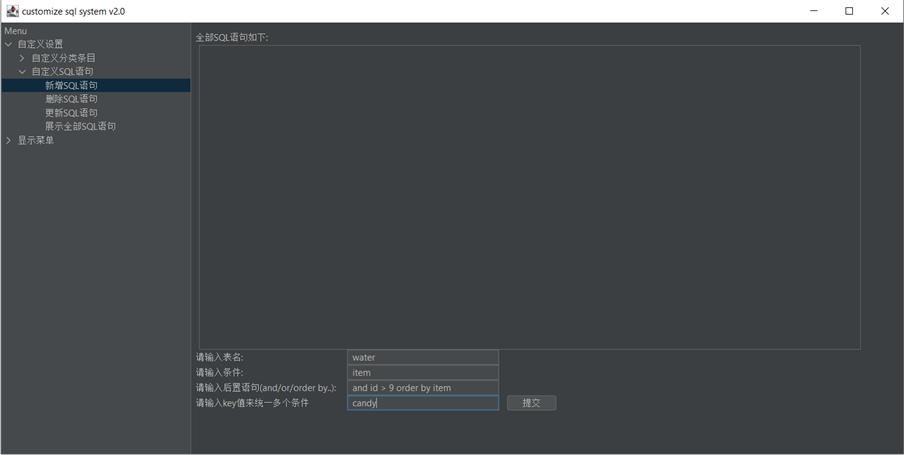

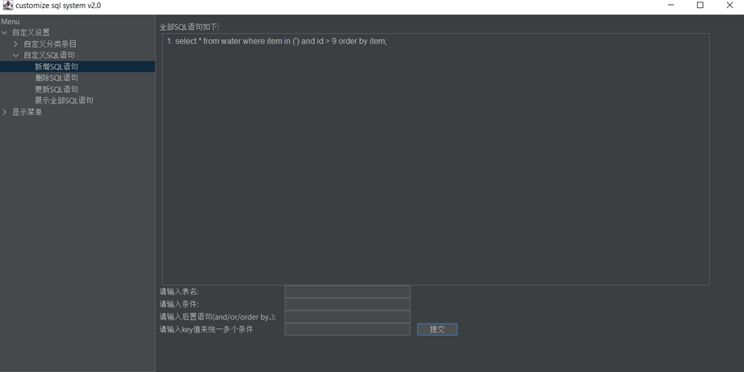

## 删除SQL语句

> 选中想要删除的语句，在下方进行确认，如果确认无误，则点击确认按钮进行删除。

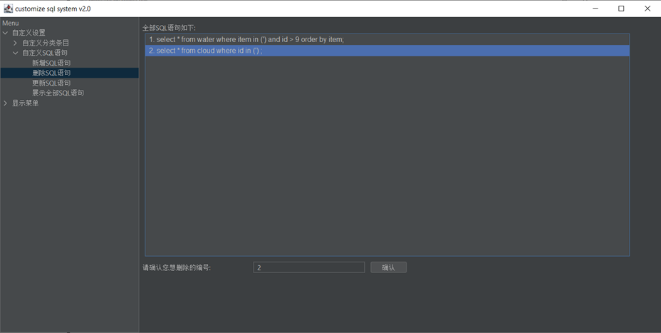

## 更新SQL语句

> 选中想要更新的语句，在下方进行更新，点击提交进行更新。
>

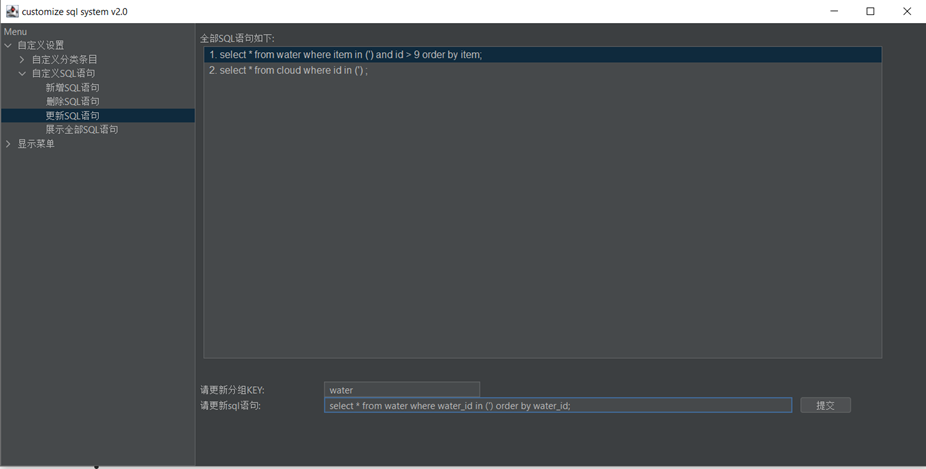

## 展示全部SQL语句

> 会展示出全部的SQL语句, 可以在搜索栏中输入关键字进行模糊查询(忽略大小写)。

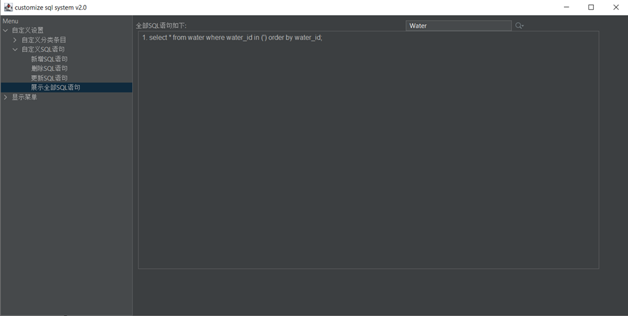

## 新增分类条目

> 在下方输入分类名称，点击按钮新增分类。

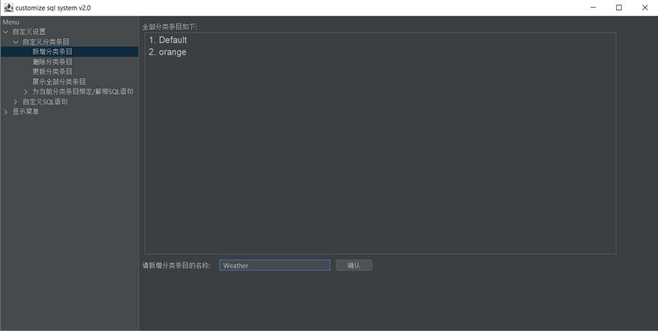

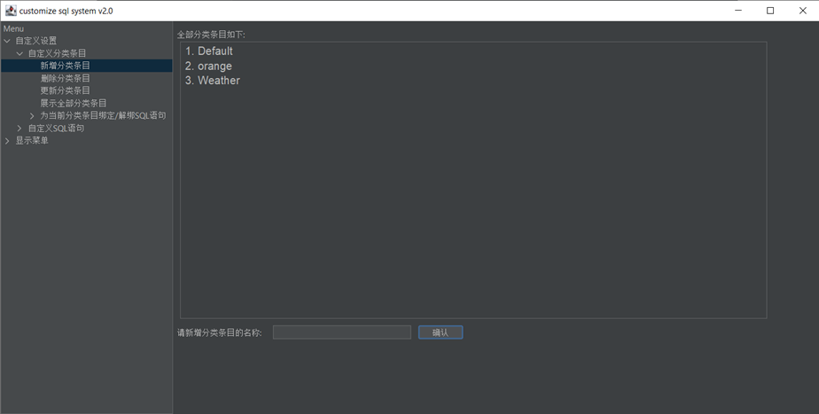

## 删除分类条目

> 选中想要删除的分类条目，并在下方进行确认，确认无误后点击确认按钮进行删除。

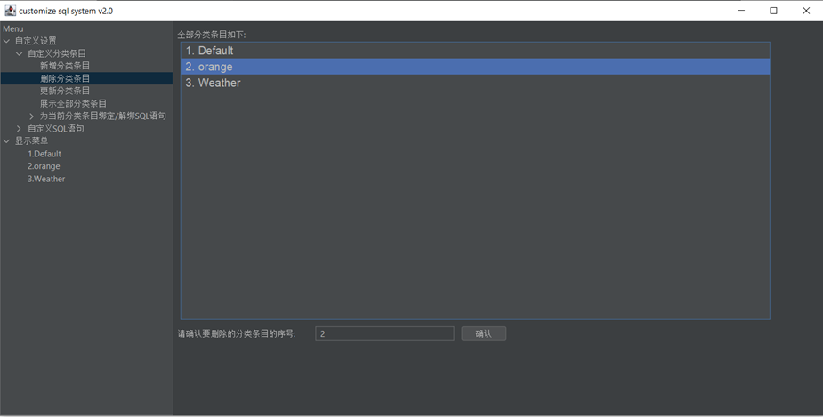

## 更新分类条目

> 选中想要更新的分类条目, 并在下方进行更新，然后点击提交。

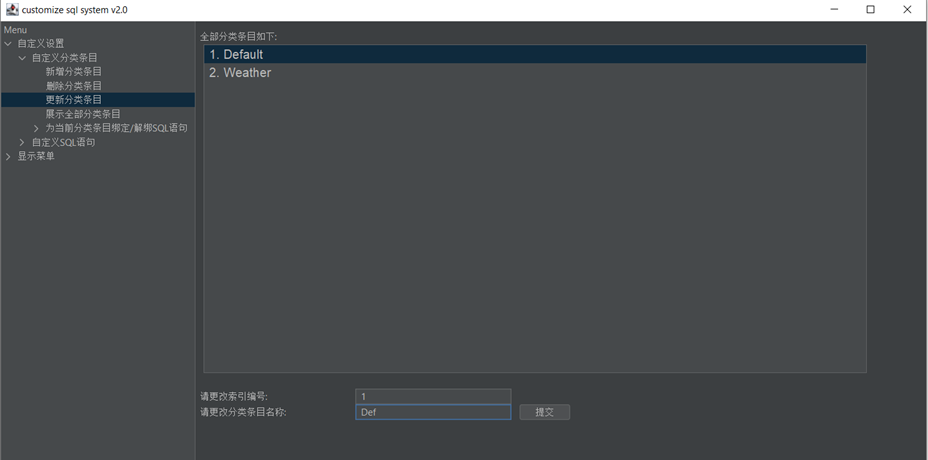

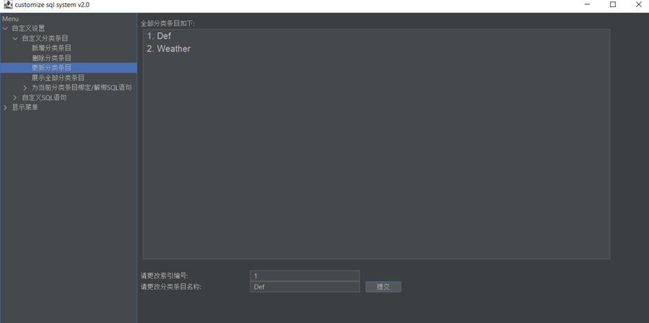

## 展示全部分类条目

> 展示全部分类条目，也可以通过搜索栏输入关键字进行模糊查询(忽略大小写)

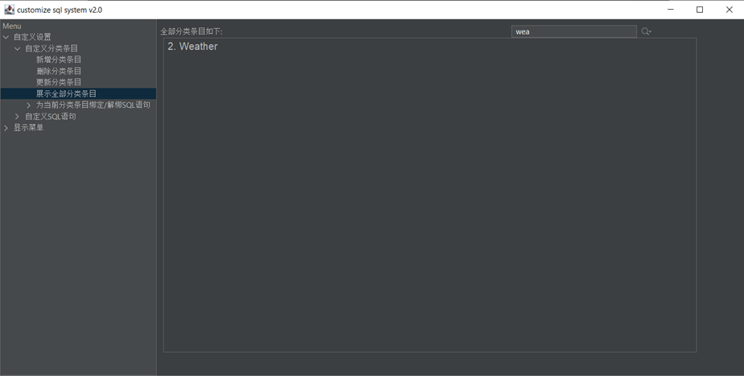

## 给当前分类绑定SQL语句

> 在左边列表中选中要绑定的分类条目。
>
> 选中后右侧栏会显示当前分类条目可以绑定的(即未绑定的)全部语句列表。如果觉得语句太多，可以在上面搜索栏中根据key和sql进行模糊查询(忽略大小写)来减少结果集。
>
> 勾选想要绑定的语句, 点击上方的绑定按钮进行绑定。
>
> 勾选的顺序即是将来在显示菜单展示语句的顺序(仅针对同一key)

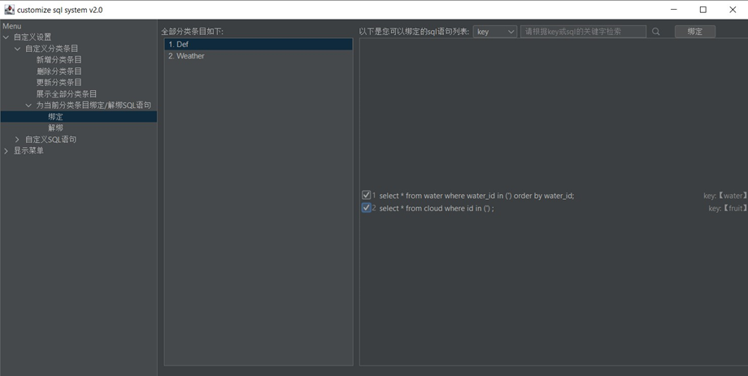

## 给当前分类解绑SQL语句

> 在左边列表中选中要解绑的分类条目。
>
> 选中后右侧栏会显示当前分类条目可以解绑的(即已绑定的按照绑定顺序展示)全部语句列表。勾选想要解绑的语句, 点击上方的解绑按钮进行解绑。
>
> 如果想要调换绑定顺序，先解绑，再重新绑定。

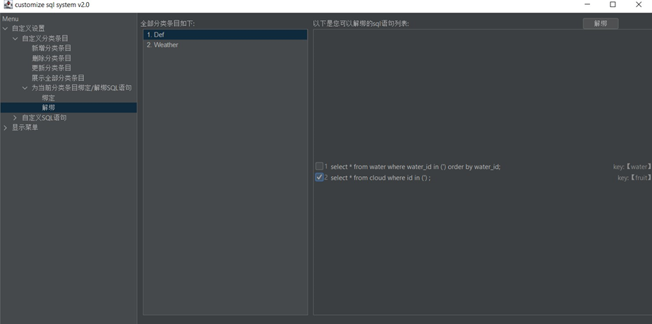

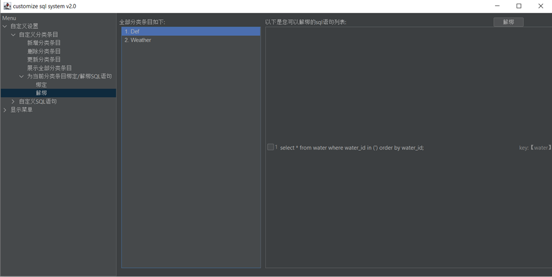

## 显示菜单

> 显示菜单的每一项都对应一个分类条目，右侧画面下方的输入参数栏是动态变化的，取决于当前分类下绑定的语句中key的个数。
>
> 可以在输入参数栏输入多个参数，但必须用英文格式的逗号分隔。
> 
> 如果希望输入多个动态变化的参数，语法为: [a,b,c,d],[a1,b1,c1,d1]。如果不确定得到的语句是什么可以去解绑出查看，也可以不输入参数直接点击确认按钮进行查看。
>
> 依次点击确认按钮，会在上方依次生成sql语句，生成完毕后可以点击右上角复制按钮进行复制。

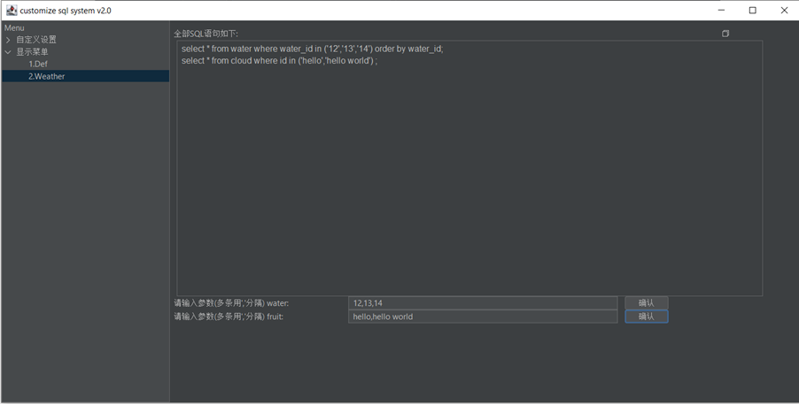
